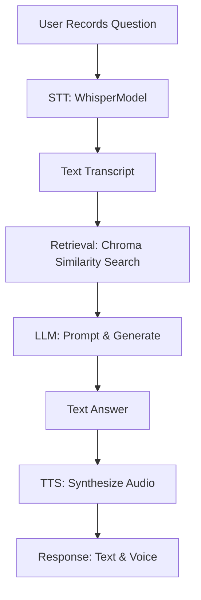

# Voice-Enabled RAG Tutor

A self‑hosted, voice‑enabled Retrieval‑Augmented‑Generation (RAG) tutor that can serve as an expert in *any* domain—from computer vision to NLP, finance, healthcare, and beyond. Speak your question into the mic; the system transcribes it, retrieves relevant document chunks, generates a grounded answer with a local LLM, and returns both text and TTS audio—complete with avatar animations.

---

## 📂 Project Structure

```plaintext
.
├── Avatar/                   # waiting & speaking avatar animations (MP4)
│   ├── avatar waiting.mp4
│   └── avatar talking.mp4
├── config/
│   └── settings.yaml         # optional configuration flags
├── data/
│   ├── raw/                  # put your domain PDFs & PPTX files here
│   └── chunks/               # auto‑generated JSON document chunks
├── db/
│   └── chroma_index/         # persisted Chroma vectorstore
├── offline/                  # four-step offline indexing pipeline
│   ├── loaders.py            # (1) load PDFs + PPTX → Documents
│   ├── splitter.py           # (2) group pages & split into text chunks
│   ├── embedder.py           # (3) sanitize & prepare chunk metadata
│   └── indexer.py            # (4) embed & persist chunks into Chroma
├── online/
│   ├── stt/
│   │   ├── whisper_stt.py    # faster‑whisper wrapper (English-only)
│   │   └── record_test.py    # CLI for mic testing & transcription
│   ├── retrieval/
│   │   └── retriever.py      # load Chroma & similarity search
│   ├── llm/
│   │   └── inference.py      # build prompt, call LLM, format citations
│   ├── tts/
│   │   └── tts_service.py    # synthesize answer to WAV via TTS engine
│   ├── temp/                 # working audio files (in/out)
│   └── server.py             # FastAPI app (endpoints `/ask/` & `/chat/`)
├── index.html                # browser UI (record, display, playback)
├── README.md                 # this file
├── requirements.txt          # pinned dependencies
└── test_output.wav           # example recording
```

---

## 🛠️ Offline Indexing (4 Steps)

1. **Load documents** (`offline/loaders.py`)
   Reads PDF & PPTX files into LangChain `Document` objects with metadata.
2. **Split into chunks** (`offline/splitter.py`)
   Groups pages, then splits text into manageable chunks (size & overlap tunable).
3. **Embed metadata** (`offline/embedder.py`)
   Sanitizes metadata for Chroma; prepares chunk payloads.
4. **Index in Chroma** (`offline/indexer.py`)
   Embeds chunks with HuggingFace model, persists vectorstore in `db/chroma_index`.

---

## 🚀 Pipeline Flowchart



> **Note:** Responses include both the **text** answer (displayed on UI or JSON) and **voice** (audio playback).

---

## ⚙️ Installation & Setup

1. **Clone & enter**

   ```bash
   git clone <repo_url> && cd voice‑chatbot
   ```

2. **Python env & install**

   ```bash
   python -m venv .venv
   source .venv/bin/activate    # Linux/macOS
   .venv\Scripts\activate.bat  # Windows
   pip install --upgrade pip
   pip install -r requirements.txt
   ```

> No OCR/Poppler needed—PDFs load with `PyPDFLoader`, PPTX via `python-pptx`.

---

## 🚀 Running the API

```bash
uvicorn online.server:app --reload --port 8000
```

* **POST** `/ask/` (audio upload) → returns JSON with `transcript`, `answer`, `citation`, `audio_url` and avatar URLs.
* **POST** `/chat/` (form text) → returns pure-text + optional audio chat.

---

## 🎤 Web UI

Visit `http://127.0.0.1:8000`:

1. **Record** your question with mic.
2. **Stop** → see **Transcript**, **Answer**, and hear audio with avatar animation.

---

## 🔧 Customization

* **LLM**: edit `online/llm/inference.py` to swap or tune the model.
* **Chunking**: adjust parameters in `offline/splitter.py` (size, overlap).
* **Retrieval**: tweak `top_k` or score threshold in `online/retrieval/retriever.py`.
* **STT**: choose model size/device in `online/stt/whisper_stt.py`.
* **TTS**: configure `online/tts/tts_service.py` for your preferred engine.

---

## 📝 Troubleshooting

* **No transcript?**

  * Check mic permissions & format.
  * Use `python online/stt/record_test.py` to record + transcribe.

* **Incomplete answers?**

  * Ensure `data/raw/` contains selectable text (not images).
  * Adjust loader in `offline/loaders.py` or fallback settings.

* **Chroma errors?**

  * Remove `db/chroma_index/` and re-run indexing.

Happy teaching & learning across *any* domain! 🎓
